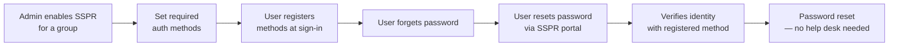
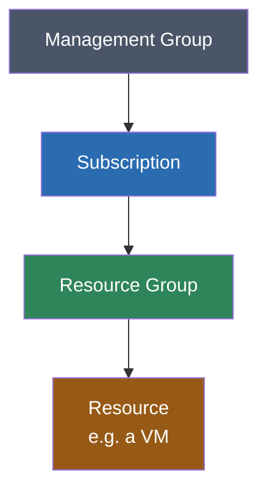

# AZ-104 Notes: Manage Azure Identities & Governance (20–25%)

## Part 1: Manage Microsoft Entra Users and Groups

### Create Users & Groups

- **Users** can be created manually, bulk-imported (CSV), synced from on-prem AD (Entra Connect), or auto-created as **guest users** (invited).
- **Groups** — two types:
  
  | Type                    | Purpose                                                        |
  | ----------------------- | -------------------------------------------------------------- |
  | **Security group**      | Used to assign permissions/access (RBAC, app access, licenses) |
  | **Microsoft 365 group** | Used for collaboration (shared mailbox, calendar, files)       |
- **Membership type**:
  - **Assigned** — you manually add/remove members.
  - **Dynamic** (user or device) — membership rule based on attributes (e.g., `department = "Sales"`), auto-updates.

### Manage User & Group Properties

- User properties: name, job title, department, manager, contact info, sign-in blocked (yes/no).
- Group properties: owners (who can manage membership), members, membership type, group-based licensing.
- Changes here don't need PowerShell/CLI for most day-to-day tasks — portal is fine, but know `Update-MgUser` / `az ad user update` exist for automation.

### Manage Licenses in Microsoft Entra ID

- Licenses (e.g., Microsoft 365, Entra ID P1/P2) can be assigned:
  - **Directly** to a user, or
  - **Group-based licensing** — assign a license to a group, all members inherit it (preferred at scale, less error-prone).
- Entra ID P1/P2 unlock premium features: P1 = dynamic groups, conditional access, SSPR with write-back; P2 = Identity Protection, PIM (Privileged Identity Management).

### Manage External Users (B2B Collaboration)

- Invite external users as **guest users** — they use their *own* identity (no password to manage on your side).
- Guest users get a **UserType = Guest**, appear in your tenant, can be added to groups and assigned RBAC roles like any internal user.
- Access can be restricted via **entitlement management** or **access reviews** (periodically confirm guests still need access).
- B2B ≠ B2C: B2B is for internal collaboration with partners; B2C is a separate product for customer-facing identity.

### Configure Self-Service Password Reset (SSPR)

- Lets users reset their own password without help desk — reduces support tickets.
- Requires:
  1. **Enable SSPR** (per user, group, or all users) in Entra ID.
  2. **Configure authentication methods** (at least 1–2 required): phone call, SMS, email (for guests), security questions, Authenticator app.
  3. Users **register** their methods (often forced at first sign-in).
- **Combined registration**: SSPR and Multi-Factor Authentication (MFA) now share the same registration experience.

---

## Part 2: Manage Access to Azure Resources (RBAC)

### Key Concept: Azure RBAC vs Entra ID Roles (classic exam trap)

|                    | **Azure RBAC**                                  | **Microsoft Entra ID Roles**                                          |
| ------------------ | ----------------------------------------------- | --------------------------------------------------------------------- |
| Controls access to | **Azure resources** (VMs, storage, RGs...)      | **Entra ID / M365 itself** (users, groups, licenses, tenant settings) |
| Example role       | Contributor, Reader, Owner                      | Global Administrator, User Administrator                              |
| Scope              | Management group → Subscription → RG → Resource | Tenant-wide                                                           |

> Rule of thumb: **"Can they manage a VM?" → RBAC. "Can they manage a user account?" → Entra role.**

### Manage Built-in Azure Roles

Three roles matter most for the exam:

| Role                          | Can do                                                          |
| ----------------------------- | --------------------------------------------------------------- |
| **Owner**                     | Full access to resources **+** can manage access (assign roles) |
| **Contributor**               | Full access to resources, **cannot** manage access/assign roles |
| **Reader**                    | View-only, no changes                                           |
| **User Access Administrator** | Manage user access only, not the resources themselves           |

- Roles are **built-in** (predefined by Microsoft) or **custom** (you define exact permissions via JSON).
- RBAC is **additive only** — you can't "subtract" permissions with a normal role assignment (deny assignments are a separate, rare mechanism).

### Assign Roles at Different Scopes

Azure resources sit in a hierarchy — roles assigned higher up **inherit down**:

- Assign **Contributor at the Resource Group** → applies to *every resource inside it*, automatically.
- Assign **Reader at the Subscription** → that user can view everything in every RG under it.
- **Best practice**: assign roles at the *highest scope that makes sense* (less admin overhead) but *narrowest scope needed* (least privilege) — these two ideas are in tension and exam questions test which one wins in a given scenario.

### Interpret Access Assignments

When given a scenario, ask three questions:

1. **Who** — a user, a group, or a service principal?
2. **What role** — what can they actually do? (Owner/Contributor/Reader/custom)
3. **What scope** — where does it apply, and what does it inherit down to?

**Example scenario:**

> "Maria is assigned **Contributor** at the **Subscription** level. Raj is assigned **Reader** on a single **Resource Group** inside that subscription."

- Maria can create/delete/modify resources anywhere in the subscription, including that RG — but cannot assign roles to others (not Owner).
- Raj can only *view* resources in that one RG — nothing else, even though Maria's broader assignment exists in parallel (assignments are additive, most-permissive wins when multiple apply to the same scope).

Use **"Check access"** or **IAM → View my access** in the portal to see effective permissions on a resource — a fast way to verify what a scenario is really asking.

---

## Quick Recap

- **Entra ID** = manages *identities* (users, groups, licenses, guests, SSPR).
- **Azure RBAC** = manages *access to resources*, assigned at MG/Subscription/RG/Resource scope, inherited downward.
- Don't confuse an **Entra role** (tenant-level, e.g. User Administrator) with an **Azure role** (resource-level, e.g. Contributor).
- Always check **scope + role + inheritance** together when reading an access-assignment scenario.

# Work to do:

1. Take at least 3 Azure policies with different "effects" (deny, auditIfNotExists, deploy) and read through the JSON.

2. Read about licensing in M365 (E3, E5) and Entra (P1 and P2)

3. See what are the different types of users that exist in Entra.

4. Types of groups (Security vs M365) and group membership (dynamic vs assigned).

5. The importance of tagging resources in Azure.

6. Download Graph Powershell, Azure Powershell and Azure CLI in computer.

# Links:

1. John Savill study cram - takes you through the entire study guide of AZ-104: https://www.youtube.com/watch?v=0Knf9nub4-k&list=PLlVtbbG169nGlGPWs9xaLKT1KfwqREHbs&index=30
