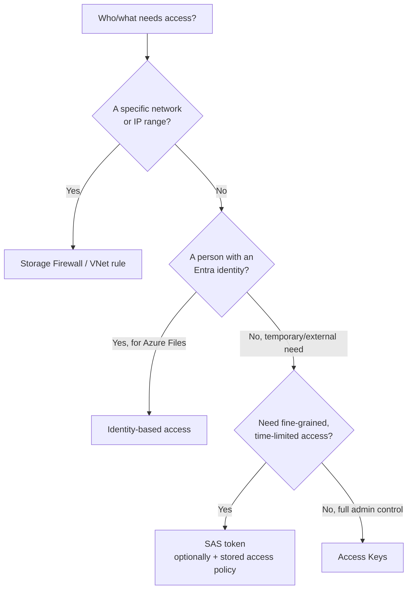

# Pre-Session Prep: Cost Management & Azure Storage

---

## 1. Cost Management

For cost management in Azure, we mainly use three tools:

| Tool | purpose|
|---|---|
| **Budgets** | Set a spending limit (monthly/quarterly/annually) — triggers alerts when you're approaching or exceeding it |
| **Alerts** | Notifications tied to a budget threshold (e.g., "notify me at 80% of budget") — doesn't stop spending, just warns |
| **Azure Advisor** | Personalized recommendations engine — flags *underused* or *misconfigured* resources to cut cost (e.g., "this VM is oversized for its usage") |

Budgets/alerts are *reactive* (tell you after the fact), Advisor is more *proactive* (suggests changes before you overspend). Why might an org want both?

---

## 2. Storage — Configure Access

Understand the core storage related access concepts.

- **Storage firewalls & VNet rules** — restrict a storage account so only specific IPs/VNets can reach it (deny-by-default once enabled).
- **SAS tokens (Shared Access Signature)** — a time-limited, permission-scoped URL that grants access *without* sharing the account key.
- **Stored access policies** — a way to group SAS token rules server-side (so you can revoke/modify many tokens at once instead of one by one).
- **Access keys** — the "master password" for a storage account (2 keys exist so you can rotate one while the other stays active). Highest privilege, lowest control — the opposite trade-off of a SAS token.
- **Identity-based access for Azure Files** — instead of a storage account key, users authenticate with their own Entra identity (Kerberos) — ties back into last session's RBAC/Entra content.

> think about the use case of each, which is most restrictive and which is least restrictive.

---

## 3. Storage Accounts — Setup & Protection

- **Creating a storage account**: main decisions at creation are
  - performance tier (Standard/Premium) - What kind of throughput does our setup expect?
  - redundancy - Ensuring disaster recoveru
  - access tier - Hot/Cold/Cool/Archive tiers (read about them)
  
- **Redundancy (LRS/ZRS/GRS/GZRS/RA-GRS)** — this is *how many copies, and where*. Pre-read question: what's the difference between protecting against a **disk failure**, a **datacenter failure**, and a **region failure**? Each redundancy tier answers one of these.
- **Object replication** — different from redundancy: this *copies blobs between two separate storage accounts* (e.g., for latency reasons or read distribution), not automatic/built-in like redundancy.
- **Encryption** — data is encrypted at rest by default (Microsoft-managed keys); know that customer-managed keys are an option but don't worry about the mechanics yet.
- **Storage Explorer vs AzCopy** — Explorer is a GUI tool (browse/upload/download visually), AzCopy is a command-line tool (built for speed/scripting/bulk transfers). Same job, different audience.

---

## 4. Azure Files & Blob Storage — Day-to-Day Config

- **File share (Azure Files)** vs **Container (Blob Storage)** — Files = SMB/NFS network file share (mount like a drive); Blob = object storage (unstructured data, accessed via API/URL, not "mounted").
- **Storage tiers** (Hot/Cool/Cold/Archive) — the trade-off is *access cost vs storage cost*. Hot = pay more to store, cheap to access; Archive = cheap to store, expensive/slow to access. Pre-read question: what's a real-world example of data that belongs in Archive?
- **Soft delete (blobs, containers, and Files)** — a safety net; deleted data is recoverable for a retention window before it's gone permanently. Same idea, three different scopes.
- **Snapshots (Azure Files)** — a point-in-time, read-only capture of a file share — different from soft delete (snapshot = manual/scheduled restore point, soft delete = safety net for deletions).
- **Blob lifecycle management** — rules that *automatically* move or delete blobs based on age/last-access (e.g., "move to Cool after 30 days, delete after 365"). This is where tiers + automation meet.
- **Blob versioning** — every time a blob is overwritten, the previous version is kept automatically (different from soft delete — versioning tracks *overwrites*, soft delete protects against *deletion*).

---

Try to answer these by looking at the docs:
1. What's the practical difference between soft delete and versioning amd could you have a scenario needing both?
2. If a company needs a full **region-level** outage to not lose data, which redundancy option is the minimum requirement?
3. When would you choose a **SAS token** over just restricting the storage account with a **firewall rule**; would you use both together?
