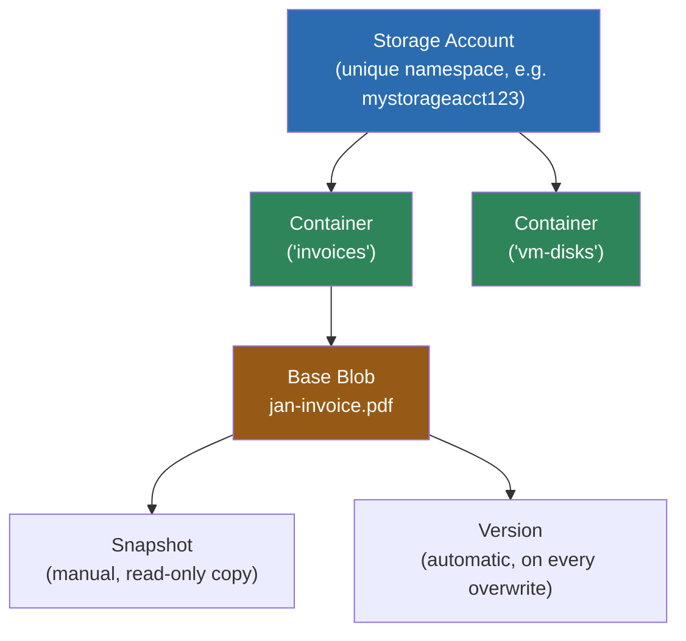
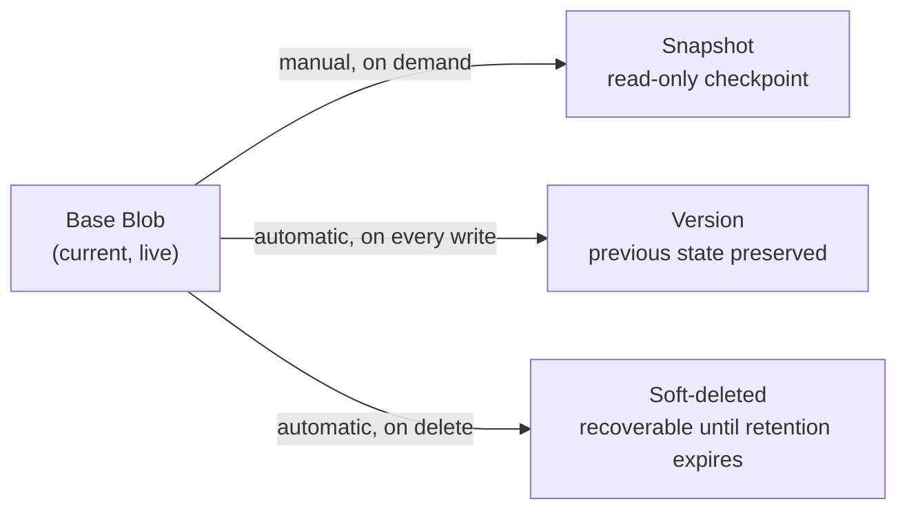
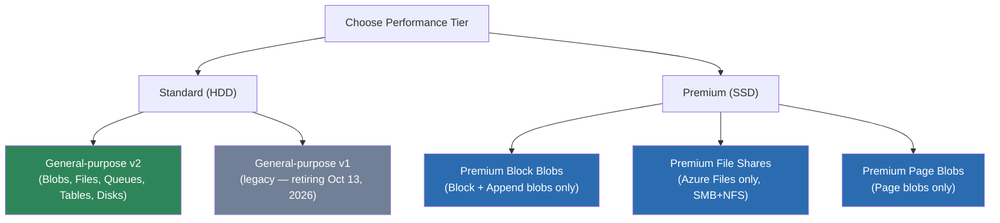
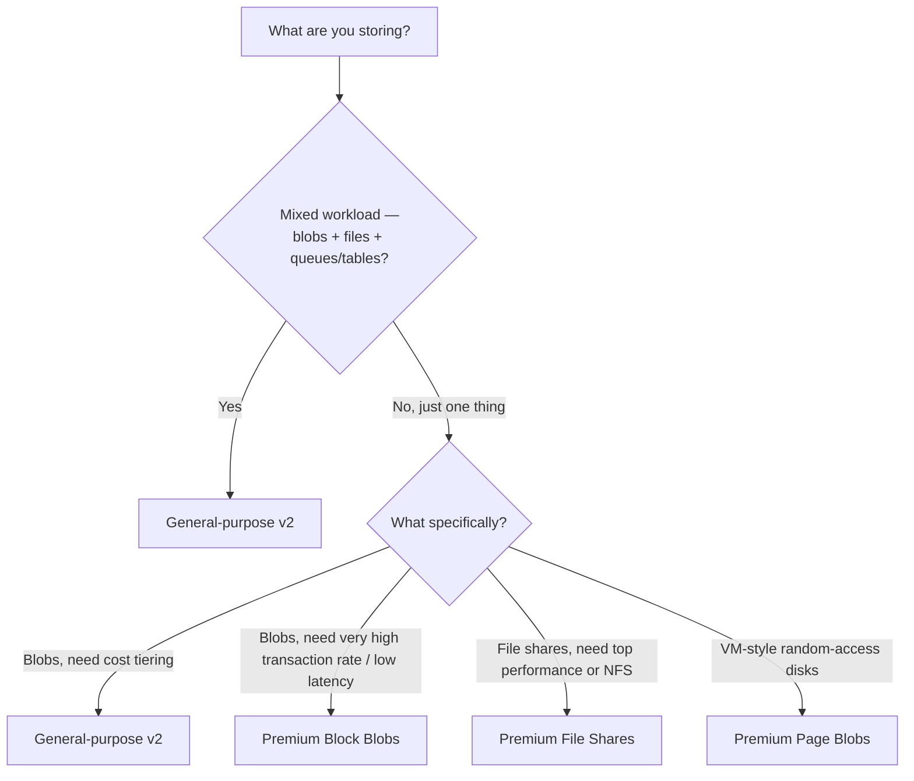

# Blob Storage & Storage Account Types

---

# PART A — Blobs & Block Blobs

## 1. The Hierarchy

- **Storage account** — the top-level namespace and billing/security boundary.
- **Container** — groups blobs. Blob Storage is actually a **flat namespace** — "folders" seen in the portal are just blob names containing `/` (e.g. `2026/jan/invoice.pdf` is one blob name, not a real folder).
- **Blob** — the object itself. Every blob is created as one of **three types** (Block, Append, Page) and that type **cannot change** afterward — to switch types you copy the data into a brand-new blob.

## 2. What Is a "Base Blob"?

The **base blob** is just the term for the **current, live version of a blob** — as opposed to its **snapshots** or **versions**, which are read-only copies of earlier states.

- All snapshots/versions share the base blob's URI, distinguished only by a timestamp/version-ID suffix.
- When the base blob is modified, its snapshots/versions **diverge** from it and start being billed as unique data (a snapshot that hasn't diverged yet costs almost nothing extra, since it just points at the same underlying blocks).
- Deleting the base blob does **not** automatically delete its snapshots — you must delete those separately (or they block the base blob's deletion, depending on how you delete).

## 3. The Three Blob Types

| Type | Structure | Write pattern | Max size | Typical use | Access tiers supported |
|---|---|---|---|---|---|
| **Block Blob** | Independent "blocks" (up to 4000 MiB each, up to 50,000 blocks), committed together | Upload blocks in parallel, in any order, then commit | ~190.7 TiB | Documents, images, videos, backups — the **default type** for any new blob | Hot, Cool, Cold, Archive |
| **Append Blob** | Also block-based, but blocks can **only be added at the end** | Append-only — existing blocks can't be edited or removed | ~195 GiB (50,000 blocks × up to 4 MiB) | Logging / telemetry — data that only ever grows | Hot, Cool, Cold, Archive |
| **Page Blob** | 512-byte "pages," addressed by byte offset | **Random read/write** — jump to and overwrite any byte range in place | Up to 8 TiB | VM disks (OS + data disks), databases needing random I/O | **Hot only** — no Cool/Cold/Archive |

**Mental model to make it click:**
- **Block blob** = a filing cabinet drawer — drop in a whole file, replace it wholesale later.
- **Append blob** = a receipt printer — you can only add to the end, never edit what's already printed.
- **Page blob** = a hard disk — jump to any spot and overwrite just that piece, which is exactly why VM disks use it.

**Exam trap:** if a scenario talks about moving a blob between Hot/Cool/Cold/Archive, it must be a **Block or Append blob** — Page blobs are Hot-tier only, since they back live VM disks that need constant fast access.

## 4. Blob "Subtypes" — Snapshots, Versions & Soft Delete

These three features all protect/preserve blob **data over time**, but they work differently. This is one of the most commonly confused areas on the exam — read carefully.

| Feature | Trigger | What it captures | Automatic? |
|---|---|---|---|
| **Snapshot** | You manually call "create snapshot" | A read-only, point-in-time copy of the base blob at that moment | ❌ Manual |
| **Version** | Any write/overwrite to the blob (once versioning is **enabled** on the account) | Automatically preserves the *previous* state before every change | ✅ Automatic |
| **Soft delete** | A blob (or its snapshots/versions) gets **deleted** | Keeps deleted data recoverable for a retention window before permanent removal | ✅ Automatic (once enabled) |

**How to tell them apart in a scenario:**
- *"I want a deliberate checkpoint before I run a risky batch job"* → **Snapshot**.
- *"I want every accidental overwrite automatically recoverable, with no extra steps"* → **Versioning**.
- *"I want to undo an accidental delete"* → **Soft delete**.
- You can — and often should — **use versioning and soft delete together**; they solve different problems (overwrite vs. deletion) and don't conflict.

Other details worth knowing:
- Snapshots aren't supported on blobs already in the **Archive** tier.
- Microsoft's current guidance: **prefer versioning over manual snapshots** where possible, since it requires no application logic to trigger.
- Enabling versioning means **every** write creates a new version — this can meaningfully increase storage cost if not paired with a lifecycle policy to clean up old versions.

---

# PART B — Storage Account Types

## 1. The Big Picture: Performance Tier × Account Kind

Every storage account is defined by two independent choices:
1. **Performance tier** — Standard (HDD-backed, cheaper) or Premium (SSD-backed, low-latency).
2. **Account kind** — what services/data types it's built to hold.

Combining these two gives you the actual list of account types you pick from at creation:

## 2. Each Account Type, Explained

| Account type | Performance | Supports | Recommended for |
|---|---|---|---|
| **General-purpose v2 (GPv2)** | Standard (SSD-backed premium GPv2 also exists, but Standard is default) | Blob (all 3 blob types), Azure Files, Queues, Tables, Disks (page blobs) | **The default choice for almost everything.** Supports access tiers (Hot/Cool/Cold/Archive), the latest features, and all redundancy options. |
| **General-purpose v1 (GPv1)** | Standard | Same services as GPv2 | **Legacy — avoid.** No access tiers. **Retiring October 13, 2026** — new creation already blocked in the portal; upgrade any existing GPv1 accounts to GPv2 (free, no downtime, no data copy needed). |
| **Premium Block Blobs** | Premium (SSD) | Block + Append blobs only (no Page blobs, Files, Queues, Tables) | High-transaction-rate workloads, especially write-heavy ones needing consistently low latency (roughly >35–40 transactions/sec/TB is the rule-of-thumb threshold to consider it). No Cool/Cold/Archive tiering — you pay a flat premium rate. |
| **Premium File Shares** | Premium (SSD) | Azure Files **only** — no blob containers, Queues, or Tables | Enterprise/high-performance file-share scenarios; the **only** account type that supports NFS file shares (in addition to SMB). |
| **Premium Page Blobs** | Premium (SSD) | Page blobs only | High-performance VM disks and other latency-sensitive, random-I/O workloads. |
| *(Legacy) Blob Storage account* | Standard | Block + Append blobs only | Superseded by GPv2 — Microsoft recommends upgrading; mentioned here mainly so you recognize it if it appears in older material. |

**Two rules that matter for the exam:**
1. **You cannot change a storage account's type after creation.** To move to a different type, create a new account and copy the data over — this includes Standard ↔ Premium and any kind change.
2. **Access tiers (Hot/Cool/Cold/Archive) are only available on Standard GPv2** (and the legacy Blob Storage account). **Premium accounts don't tier** — you pay one flat, high-performance rate regardless of access pattern.

## 3. Quick Decision Guide

---

## Quick Recap Table

| Concept | One-line distinction |
|---|---|
| Base blob vs Snapshot vs Version | Base = current/live; Snapshot = manual checkpoint; Version = automatic on every write |
| Block vs Append vs Page blob | Block = general files (replace wholesale); Append = log-style, add-only; Page = random read/write, VM disks |
| Snapshot vs Versioning | Snapshot = you trigger it manually; Versioning = automatic on every overwrite |
| Versioning vs Soft delete | Versioning = protects against **overwrites**; Soft delete = protects against **deletions** |
| GPv2 vs Premium account kinds | GPv2 = flexible + tiering + cheaper; Premium = one specialized data type + SSD speed, no tiering |
| GPv1 vs GPv2 | GPv1 = legacy, no tiering, retiring Oct 2026; GPv2 = current default, always prefer it |
